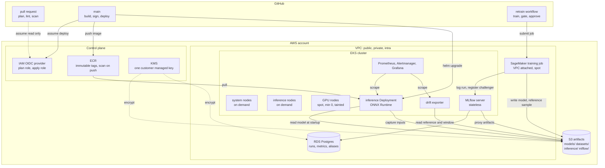

# Architecture

What each piece is, why it is that way, and what it costs. Read the decision records
at the end if you are evaluating whether to keep a choice: each one states the
alternative that was rejected and why, so you can reverse it knowingly.

## The shape of it



Two things in that diagram are worth stating in words, because they are the decisions
most often made differently.

**The training job runs inside the VPC, and the CI runner does not.** MLflow is a
ClusterIP service and the EKS endpoint is private, so a GitHub-hosted runner can
reach neither. Everything that needs to talk to MLflow is submitted as a VPC-attached
SageMaker job by `scripts/run_vpc_job.sh`. The alternative is a self-hosted runner
inside the VPC, which is also fine and which the deploy job needs anyway if you keep
the endpoint private.

**Online inference runs on EKS, not on a SageMaker endpoint.** Prometheus scrapes a
pod and cannot scrape a managed endpoint. Serving on EKS means the model and data
layers of the dashboard come from the same scrape as the infrastructure layer, so one
query can put prediction distribution next to pod CPU. The serving image still
implements `/ping` and `/invocations`, so moving to a SageMaker endpoint later is a
deployment change rather than a rewrite; you would then lose the model and data
panels and have to rebuild them from CloudWatch.

## The lifecycle

```
     code                data                   model
       |                   |                      |
   git commit         S3 datasets/           MLflow registry
       |                   |                      |
       +---------+---------+                      |
                 |                                |
           training job                           |
                 |                                |
         train, export ONNX                       |
                 |                                |
        ONNX parity check  <-- fails here: do not register
                 |
        metrics through the ONNX graph
                 |
          promotion gate    <-- holds here: registered, not promoted
                 |
        register challenger ------------------> challenger alias
                 |
        human approval
                 |
        move champion alias ------------------> champion, previous
                 |
             deploy
                 |
        pods fetch the artifact, report the version
                 |
        Prometheus scrapes four layers
                 |
        drift exporter compares inputs against the reference
                 |
           alert, decide, retrain
```

Every arrow that can stop the flow is marked. The two that matter most are the ONNX
parity check and the gate, and they fail for different reasons: parity failing means
the artifact disagrees with the model you measured, and the gate holding means the
model is fine and simply not better.

## Component by component

### Network

Three subnet tiers, and the third is the one usually left out.

| Tier | Contents | Internet route |
|---|---|---|
| public | NAT gateways only | yes |
| private | nodes, pods, MLflow, RDS, SageMaker job ENIs | through NAT |
| intra | EKS control plane ENIs, VPC interface endpoints | none |

A subnet with no default route is the strongest available statement that a component
cannot reach the internet, and it is much stronger than a security group rule someone
can widen later.

The S3 gateway endpoint is the most important line in that module. Training pulls
datasets and pushes checkpoints measured in gigabytes, and every byte through a NAT
gateway is billed twice, once for the hour and once for the data. The gateway endpoint
removes S3 from that path entirely and costs nothing per hour. The interface endpoints
for ECR do the same for image pulls and do carry an hourly charge per zone, which is
why they are a variable.

### Artifact storage

One bucket, four prefixes, four different lifecycle rules, because the four kinds of
object have four different useful lifetimes.

| Prefix | Contents | Lifecycle |
|---|---|---|
| `models/` | every registered artifact | kept; noncurrent versions for a year |
| `datasets/` | training snapshots, drift reference | IA at 30 days, Glacier IR at 120 |
| `inference/` | captured request payloads | expired at 90 days |
| `mlflow/` | whatever the tracking server writes | follows MLflow's own retention |

`inference/` is the prefix that grows without bound if its rule is removed. It is also
the one with the most objects and the smallest ones, which is why S3 bucket keys are
enabled: without them every object read is a separate billable KMS call.

Encryption uses a customer managed key rather than SSE-S3, and the reason is not
encryption strength. A customer managed key gives you a second, independent
authorisation check on every read, auditable in CloudTrail and revocable without
touching a bucket policy. The practical consequence is the one that costs people an
hour: a role with `s3:GetObject` and no `kms:Decrypt` gets an `AccessDenied` that
names S3.

### Cluster

Three node groups, because the workloads have different failure tolerances and very
different prices.

| Group | Capacity | Size | Taint | Why |
|---|---|---|---|---|
| system | on demand | 2 to 4 | none | CoreDNS, Prometheus, MLflow. Untainted so anything without a selector lands here |
| inference | on demand | 2 to 6 | none | A spot reclamation during a traffic peak is a customer-visible latency event |
| gpu | spot | 0 to N | `nvidia.com/gpu` | Training is interruptible and restartable, which is exactly what spot is for |

The taint on the GPU group is the highest-value line in the EKS module. Without it the
scheduler will place an ordinary CPU pod on a GPU node because it has free CPU and
memory, and you pay GPU rates to run a sidecar.

`AL2023_x86_64_NVIDIA` ships the driver and does not ship the Kubernetes device
plugin. Until the plugin runs, the node advertises no `nvidia.com/gpu` resource and
every GPU pod stays Pending with a message that reads like a quota problem. The
observability module installs it.

### MLflow

Three pieces with three different failure consequences.

| Piece | State | If you lose it |
|---|---|---|
| RDS Postgres | runs, params, metrics, the registry and its aliases | you lose the record of what served production |
| S3 prefix | the ONNX files | you lose the models. Versioned, so unlikely |
| Deployment | none | nothing. Kill it freely |

Running MLflow on its default SQLite backend is the failure this module exists to
prevent. It works until two pipeline runs register a model in the same moment, at which
point one fails with a database lock error, and it offers no backup to restore from.

The server runs with `--serve-artifacts`, which proxies artifact reads and writes
through the server. Only the server's IRSA role needs S3 access to the MLflow prefix;
a client needs none. The database password is generated and rotated by RDS, stored in
Secrets Manager, and resolved by an init container at pod start, so it appears in no
Terraform state, no manifest and no git history.

MLflow has no authentication in its open source form, so network reachability is the
entire access control story: a ClusterIP service, a default-deny NetworkPolicy, and an
explicit allow from the two namespaces that need it.

### Identity

Five IRSA roles, each scoped to the smallest useful permission set.

| Role | Read | Write | Notes |
|---|---|---|---|
| inference | `models/`, `mlflow/` | `inference/` | No write to `models/`. A compromised serving pod must not be able to replace the model it serves |
| drift | `datasets/`, `inference/` | nothing | Which is why it can safely run continuously |
| pipelines | `datasets/`, `models/` | `datasets/`, `models/` | Plus `iam:PassRole` on the SageMaker role, conditioned on `PassedToService` |
| mlflow | `mlflow/` | `mlflow/` | Plus `GetSecretValue` on exactly one secret ARN |
| ebs-csi | n/a | n/a | Volume creation, plus KMS on the platform key |

Every trust policy uses `StringEquals` against an explicit list of subjects. There is
deliberately no way to express a wildcard, because a wildcard `sub` lets every service
account in the cluster assume the role, and that single character is the difference
between a scoped identity and a cluster-wide one.

CI has two roles rather than one. The plan role is read-only and trusted by pull
requests; the apply role can write and is trusted only by `main` and by an approved
environment. A pull request cannot obtain the apply role at all, which matters most on
a public repository where anyone can open one.

### Observability

Four layers, and the lower two are what this repository adds.

| Layer | Source | Example question |
|---|---|---|
| infrastructure | kube-state-metrics, cAdvisor, node exporter | is the pod up |
| application | `inference_requests_total`, `..._duration_seconds` | is it answering, and how fast |
| data | `inference_input_rejected_total`, `model_drift_psi` | is what arrives still what we trained on |
| model | `inference_prediction`, `..._clamped_total` | is what leaves still sensible |

Eleven alert rules, seven recording rules, one dashboard with 27 panels across five
rows. Every metric name is defined once in `src/serving/metrics.py` or
`src/pipelines/drift.py`, and `scripts/check_metric_names.py` fails the build if a
dashboard or an alert queries something nothing emits. That check exists because the
failure it prevents is silent: an empty panel and an alert whose query returns no
series both look exactly like health.

Cardinality is bounded by design. `model_version` is the only label that changes over
time and it changes on deploy, not per request. No label carries a user id, a request
id or a raw feature value.

## Cost

Rough shape rather than numbers, because prices change by region and over time and an
invented figure is worse than none. Check the AWS pricing calculator for your region.

**Always on, whether or not anything is happening:**

| Item | Relative cost | Lever |
|---|---|---|
| EKS control plane | fixed, per cluster | one cluster per environment, or share one with namespaces |
| system + inference nodes | four on-demand instances | `inference_min_size` is 2 for availability, not performance |
| NAT gateway | hourly plus per GB | `single_nat_gateway = true` saves two thirds |
| VPC interface endpoints | hourly per endpoint per zone | `enable_interface_endpoints = false` in a quiet account |
| RDS | one instance, plus a standby if multi-AZ | `db_multi_az = false` in dev |
| Prometheus and Grafana volumes | EBS gp3 | `prometheus_storage_size` |

**Per use:**

| Item | Lever |
|---|---|
| GPU training | spot by default, `min_size = 0`, so idle costs nothing |
| S3 storage | the four lifecycle rules; `inference/` is the one that grows |
| KMS requests | S3 bucket keys are on, which cuts this by a large factor |
| CloudWatch logs | control plane logging is on; flow logs are off by default |
| Data transfer | the S3 gateway endpoint is the single largest saving here |

The three levers that matter most, in order:

1. `single_nat_gateway`. In a development account this is usually the largest line
   after the control plane.
2. GPU on demand versus spot. Several times the price for a workload that can be
   interrupted and restarted.
3. The `inference/` lifecycle rule. It costs nothing today and grows without bound.

A cheap development posture: `single_nat_gateway = true`,
`enable_interface_endpoints = false`, `gpu_max_size = 0`, `db_multi_az = false`,
`enable_flow_logs = false`, `prometheus_storage_size = "20Gi"`. And
`make destroy` when you are done with it.

## Decision records

### Poisson head rather than squared error

The target is a count of bikes. A squared-error regression on a count returns negative
predictions for low-demand hours routinely, and a negative count is wrong in a way no
threshold can fix. The model predicts `log(rate)` and the graph exponentiates, so a
negative prediction is structurally impossible.

**Rejected:** squared error with a clamp at the serving boundary. The clamp is still
there as a boundary guard, and `InferencePredictionClamped` is a critical alert
precisely because it should never fire. Relying on it as the mechanism means serving a
zero where the model meant something else, and never finding out.

### Scaling inside the graph

The training split's mean and standard deviation are registered as buffers, so they are
saved with the checkpoint and exported into the ONNX file. One artifact, no scaler.

**Rejected:** a separate preprocessing artifact. Shipping two artifacts that must
agree is the most common source of training-serving skew in production ML, and the
failure is silent: every prediction is wrong, nothing raises, latency is unchanged, and
every dashboard stays green.

### A bootstrap noise floor in the gate

The challenger must beat the champion by more than the standard deviation of the metric
under resampling of the test set, times a configurable multiplier.

**Rejected:** comparing point estimates. Two training runs of the same code with
different seeds often differ by more than the improvement a naive gate would accept, so
such a gate promotes noise about half the time and the registry fills with versions
that are not improvements while everyone believes the process is working.

### MLflow aliases rather than stages

MLflow deprecated registry stages in 2.9.0 and the 3.16.0 client still carries the
warning. Aliases are also a better fit: `champion` is a movable pointer, and moving a
pointer is atomic, auditable and reversible.

### One registry, not two

MLflow owns the registry. The SageMaker model package group is available behind
`enable_sagemaker_model_registry` and is off by default.

**Rejected:** running both as sources of truth. On the day they disagree, nobody can
say which is right, and that day arrives.

### No CPU limit on the inference container

A memory limit is set; a CPU limit is not. CPU throttling on an inference pod presents
as tail latency with no matching rise in request rate, which is one of the hardest
symptoms to diagnose from a dashboard. The CPU request plus the HPA bounds consumption.

**Reversible:** set `resources.limits.cpu` and raise `limits.intraOpThreads` to match
it, never above. If you do, expect `InferenceLatencyHigh` to become harder to read,
and note it in your own runbook.

### Digest pinning everywhere

Container base images, action references and Python dependencies are all pinned by
content rather than by a movable name: digests, commit SHAs and package hashes.

The action pinning is the one with a track record: several supply-chain incidents have
worked by moving a tag that thousands of workflows referenced. The Python hashes mean a
compromised index cannot serve a different wheel. The base image digests mean the image
you rebuild next month is the image you tested, and `scripts/pin_digests.sh --check`
can gate a release branch on it.

### A drift exporter, not a CronJob

Prometheus scrapes, and a pod that exits cannot be scraped. A CronJob that computes a
score and exits leaves the value nowhere Prometheus can see, which is why teams reach
for a Pushgateway and inherit its staleness problems. A small always-on Deployment that
recomputes on a timer fits the scrape model directly, and its own last-success
timestamp becomes the signal that tells you the monitor itself has stopped, which is
the failure mode that otherwise looks exactly like health.

### The gate holding is a success, not a failure

`pipelines train --exit-zero-on-hold` exits 0 when the gate refuses to promote, and
`gate.json` carries the decision. A scheduled retrain that produced a worse model and
declined to promote it did its job, and a workflow that reports that as a failure will
page someone every week for correct behaviour until they stop reading the alerts.
